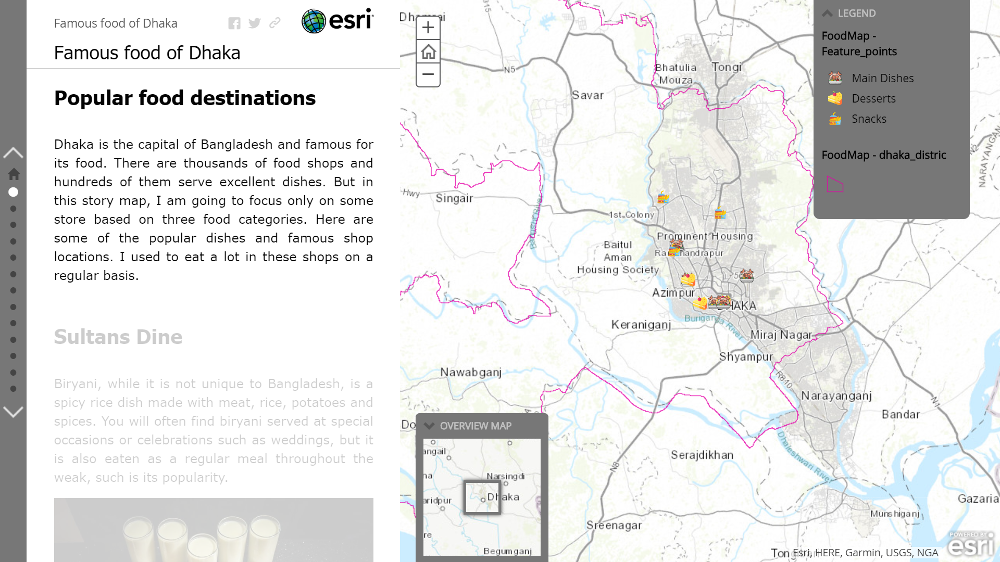
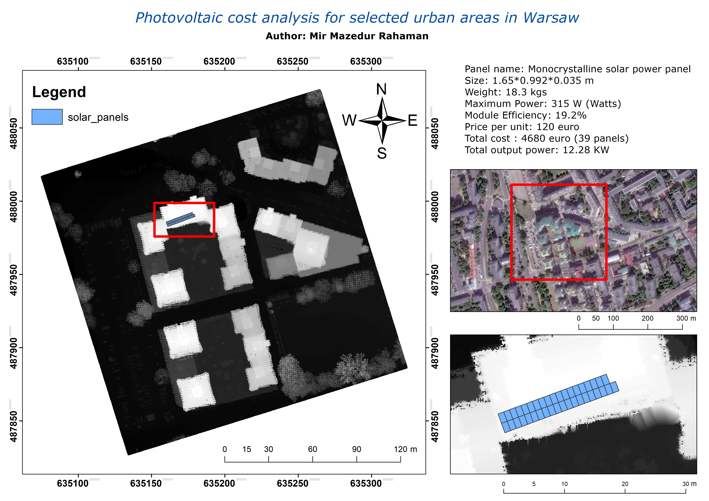
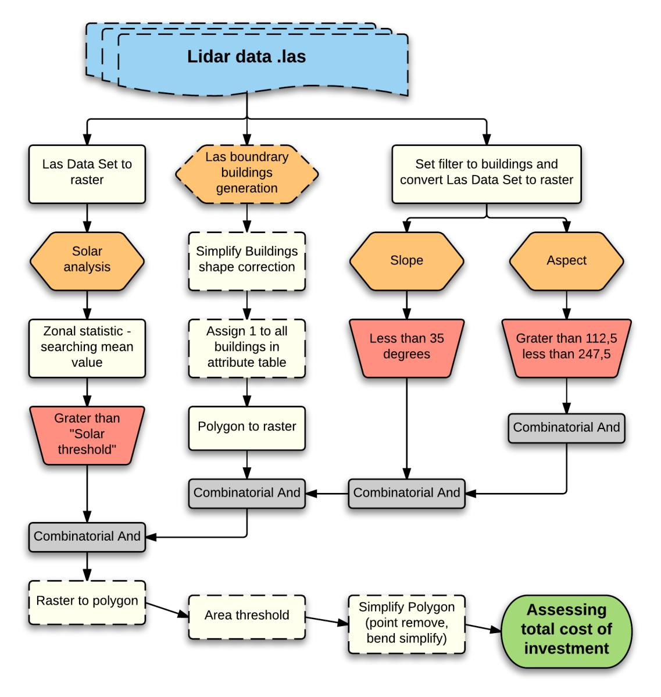
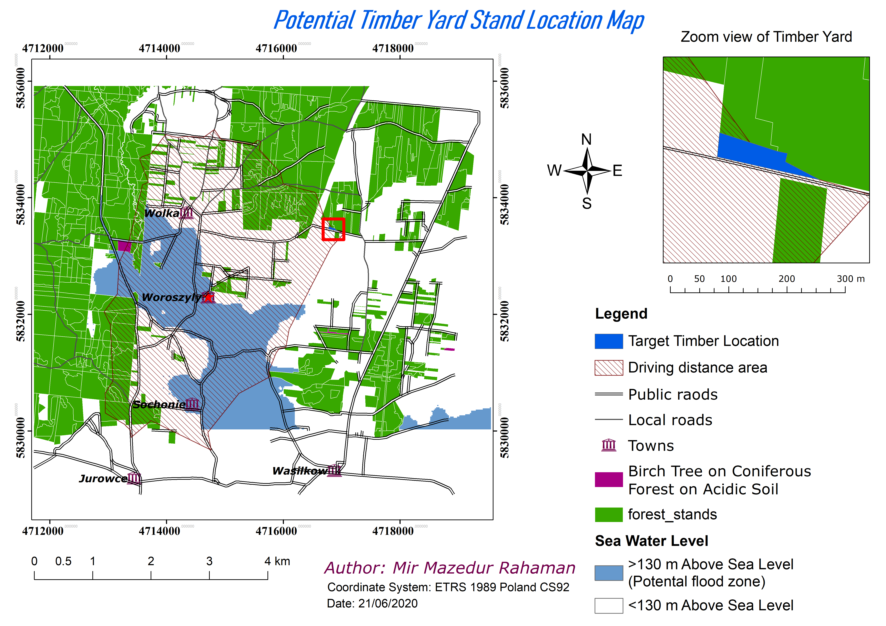

# Famous food of Dhaka

The project goal was to creat an ArcGIS story map in the ArcGIS online platform.The story map is about famous food of Dhaka, Bangladesh.
The story map contain following features:
- The area of interest map overlay
- Variable visiblity of the point of interest
- A legend with custom icons and categoty
- Popup to each point with few variable attributes like:
    - Restaurant Type
    - Price
    - Opening hours
    - Name
- Lastly a route map

See the online Map here [https://arcg.is/0nKm840](https://arcg.is/0nKm840)

---
  

# Making tree inventory and virtual plot using LiDAR and UAV data

The project was divided into two tasks:
1. A pine tree inventory from LiDAR and UAV data.
2. Create a virtual sample plot with a radius of 12.62 m

## Task 1:
1. Generate and calculate CHM_LiDAR base on the difference between DTM_LiDAR and
DSM_LiDAR
2. Generate and calculate CHM_UAV base on the difference between DTM_LiDAR and
DSM_UAV
3. Make a trees segmentation base on CHM_UAV and CHM_LiDAR and calculate:
    - The number of trees
    - The maximum, minimum and mean height (TH)
    - The mean diameter of crowns
    - The mean crown area and the histogram of crown areas
    - The mean DBH (Diameter at breast height) base on the formula for the pine height
(TH) expressed by: `𝐷𝐵𝐻 = 0.3029 ∗ 𝑇𝐻^{1.47225}`
4. Create a comparison of the above results between CHM_UAV and CHM_LiDAR
    - UAV tree inventory result can be found here [UAV DATA](results/UAV_all.xlsx)
    - LiDAR tree inventory result can be found here [LiDAR DATA](results/LiDar_all.xlsx)

## Task 2:
1.  Calculate Laser Penetration Index (LPI) base on the total number of ground points from
LiDAR data (GR) and the total number of all points from LiDAR data (AR)
`LPI = GR/AR`
2. Add a one random point within the extend and create a virtual sample plot with a radius of 12.62 m
3. Calculate all metrics for the plot base on the segmentation mentioned in point number 3 of task 1 and
 for LiDAR data only
    - The result can be found here [Virtual Plot DATA](results/UAV_AOI.xlsx)
4. Virtually cut all the trees and create solar radiation presentation for this artificial gap,
5. Create a final layout with the results of all the calculation.

---
  

# Comparison of GNSS, GPS and Mobile GPS and its error in the Forest environment

The task is to visulization of point which are recorded from GNSS, GPS corrected, GPS uncorrected and Mobile GPS devices in a forest path.
- There are 25 reference point and in each point data were recorded from ths mentioned devices
- In every point take a picture of the skyview
- Compare the error of the devices to the reference points
- Show a statistical comparison between the devices
- The [Excel table](results/reference_with_distance.dbf.xlsx) is exported from ArcGIS attribute table and the furture modified

---
  

# Photovoltaic cost analysis for selected urban areas in Warsaw

The task is to process a LiDAR data from an urban area for locating photovoltanic site and a cost analysis for photovoltanic palenls.
the project requirements is as follows:
- Crop the las file to a with dimensions of 200x200 meters
- The raster resolution should be 20x20 meters
- Aspect should be within 112,5 to 247,5 degrees

The task is done in ArcGIS using [LAStools](https://rapidlasso.com/lastools/) toolbox. The full workflow is given below

---
  

# Find location for timber yard, which must be in the area where all following conditions are satisfied:
- Forest with _Birch_ tree species
- Forest with _Fresh pine/coniferous forest_ site type
- Forest with _acidic_ soil
- Located 130 m aboce see level (avoide possible flood region)
- Located within 3200 m (driving through road network) from _Woroszyly_ town

The final output after all the analysis looks like below image:
